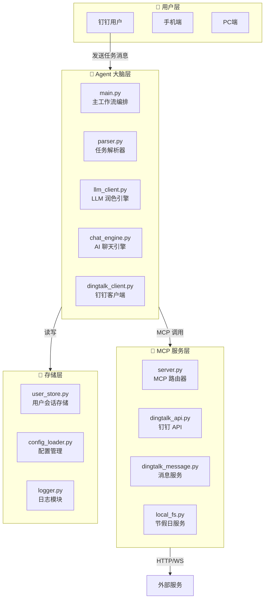
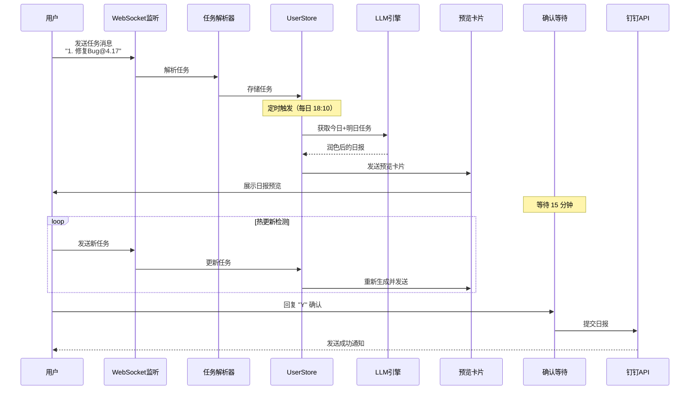

# LingXi Daily Agent

> 智能工作日报生成与发送 Agent - 自动化、AI 润色、实时交互、节假日自动同步

<p align="center">
  
  
  
  
</p>

---

## 📋 项目简介

LingXi Daily Agent 是一款面向企业办公场景的智能化日报助手，采用 **Agent 架构设计**，将复杂的工作日报生成流程拆解为消息监听、任务解析、AI 润色、双模确认、消息推送等多个独立模块，通过 MCP 解耦底层 API 调用。

### 核心特性

| 特性 | 说明 |
|------|------|
| 📱 **纯消息驱动** | 无需文件，完全通过钉钉消息添加任务 |
| 🤖 **Agent 编排** | 大脑层负责工作流编排，不直接调用底层 API |
| 🧠 **AI 智能润色** | 调用大模型将口语化任务转换为专业职场表述 |
| 📱 **钉钉深度集成** | WebSocket 长连接实时接收消息，卡片消息推送 |
| 🔄 **热更新机制** | 15 分钟确认期内发送新任务，自动重新生成 |
| 📅 **节假日自动同步** | 启动时自动检查并同步官方数据，无需手动维护 |
| 👀 **考勤状态联动** | 自动检测请假/休息状态，静默跳过 |
| 👥 **多用户支持** | 独立会话隔离，个性化模板配置 |
| 🌐 **联网搜索** | 支持天气、资讯等实时信息查询 |

---

## 🏗 系统架构

### 整体架构图



### 工作流程图



---

## 📦 项目结构

```
LingXi_Daily_Agent/
├── agent/                          # Agent 核心业务逻辑
│   ├── main.py                     # 主工作流入口
│   ├── parser.py                   # 任务解析器（解析钉钉消息）
│   ├── llm_client.py               # LLM 润色引擎
│   ├── chat_engine.py              # AI 聊天引擎（非任务消息）
│   ├── dingtalk_client.py          # 钉钉客户端（消息发送+监听）
│   └── prompts/
│       └── report_polish_prompt.txt # 日报润色提示词
│
├── mcp_server/                     # MCP 工具服务层
│   ├── server.py                   # MCP 路由器
│   └── services/
│       ├── dingtalk_api.py         # 钉钉 API 封装
│       ├── dingtalk_message.py     # 消息服务（卡片+监听）
│       ├── holiday_api.py          # 节假日在线查询
│       └── local_fs.py             # 本地文件服务
│
├── common/                         # 公共模块
│   ├── config_loader.py            # 配置加载
│   ├── logger.py                   # 日志模块
│   ├── user_store.py               # 用户会话存储（内存）
│   └── holiday_auto_update.py      # 节假日自动更新
│
├── tools/                          # 辅助工具
│   ├── fetch_dingtalk_ids.py       # 初始化工具（获取 UserID/模板）
│   ├── sync_holidays.py            # 节假日数据同步工具
│   └── test_sync.py                # 同步功能测试脚本
│
├── config.yaml                     # 业务配置文件
├── logging.yaml                    # 日志配置文件
├── holiday.json                    # 年度节假日配置（自动同步）
├── requirements.txt                # Python 依赖
└── .env                            # 环境变量
```

---

## 🚀 快速开始

### 1. 环境要求

| 环境 | 要求 |
|------|------|
| Python | 3.10+ |
| 操作系统 | macOS / Linux / Windows |
| 钉钉 | 企业账号（需开放平台开发者权限） |
| 大模型 | OpenAI 兼容 API（推荐阿里千问） |

### 2. 克隆与安装

```bash
# 克隆项目
git clone <repository-url>
cd LingXi_Daily_Agent

# 创建虚拟环境
python -m venv .venv

# 激活虚拟环境
# macOS / Linux
source .venv/bin/activate
# Windows
.venv\Scripts\activate

# 安装依赖
pip install -r requirements.txt
```

### 3. 环境变量配置

```bash
# 复制环境变量模板（如需要）
cp .env.example .env

# 编辑 .env 文件，填入实际配置
```

`.env` 文件配置项详解：

| 变量名 | 必填 | 说明 | 获取方式 |
|--------|:----:|------|----------|
| `DINGTALK_CLIENT_ID` | ✅ | 钉钉应用 AppKey | 钉钉开放平台 |
| `DINGTALK_CLIENT_SECRET` | ✅ | 钉钉应用 AppSecret | 钉钉开放平台 |
| `DINGTALK_ROBOT_CODE` | ✅ | 机器人 Code | 钉钉开放平台 |
| `DINGTALK_USER_ID` | ✅ | 默认用户的 UserID | 运行初始化工具获取 |
| `DINGTALK_TEMPLATE_ID` | ✅ | 默认日志模板 ID | 运行初始化工具获取 |
| `LLM_API_KEY` | ✅ | 大模型 API Key | 阿里云 DashScope |
| `LLM_BASE_URL` | ✅ | API 端点地址 | 默认 `https://dashscope.aliyuncs.com/compatible-mode/v1` |
| `LLM_MODEL` | ✅ | 模型名称 | 如 `qwen-plus`、`qwen-turbo` |

> **注意**：`DINGTALK_USER_ID` 和 `DINGTALK_TEMPLATE_ID` 是单用户模式的配置，也是多用户模式下的全局默认值。

### 4. 获取钉钉 UserID 和模板 ID

```bash
# 运行初始化工具（需先配置 CLIENT_ID 和 CLIENT_SECRET）
python tools/fetch_dingtalk_ids.py 你的手机号
```

输出示例：

```
=======================================================
  👤 UserID：xxxxxxxxxxxx
-------------------------------------------------------
  📋 可见日志模板列表（共 2 个）:
    模板名称: 安建数科一般员工日志 | ID: template_xxx1
    模板名称: 每日日报           | ID: template_xxx2
=======================================================

💡 请将以下信息填入 .env 文件：
   DINGTALK_USER_ID=xxxxxxxxxxxx
   DINGTALK_TEMPLATE_ID=<选择模板 ID>
```

### 5. 业务配置（config.yaml）

```yaml
# 定时任务配置
scheduler:
  report_time: "18:10"          # 每天生成日报的触发时间 (HH:MM)
  confirm_timeout_min: 15       # 人工确认等待窗口（分钟）
  check_interval_sec: 10        # 任务热更新轮询间隔（秒）

# 节假日文件路径（自动同步，无需手动维护）
paths:
  holiday_file: "./holiday.json"

# 钉钉业务配置（全局默认值，可被 per-user 配置覆盖）
dingtalk:
  report_field_today: "今日工作"    # 今日工作字段名
  report_field_tomorrow: "明日计划" # 明日计划字段名
  report_dd_from: "report"          # 日志来源标识
  # 模板自动识别关键词
  daily_report_name_keywords:
    - "日报"
    - "每日"
    - "日志"

# AI 大模型相关配置
llm:
  location: "合肥市"  # 用户位置信息，用于天气等问题问答
  web_search:
    provider: "qwen"  # 启用阿里千问联网搜索
  chat_system_prompt: |
    你现在是 LingXi 办公助理...

# 多用户配置（可选）
# users:
#   - user_id: "user001"
#     template_id: "template_abc"
#     contents:
#       - sort: 1
#         key: "今日工作"
#       - sort: 2
#         key: "明日计划"
```

### 6. 启动 Agent

```bash
python -m agent.main
```

启动后，Agent 将：
1. ✅ 自动检查并同步节假日数据
2. ✅ 连接钉钉 WebSocket 监听消息
3. ✅ 进入定时等待状态
4. ✅ 用户发送任务后自动处理

---

## 🛠 钉钉开放平台配置指南

### 步骤 1：创建企业应用

1. 登录 [钉钉开放平台](https://open.dingtalk.com/)
2. 进入「应用开发」→「企业内部开发」
3. 点击「创建应用」
4. 填写应用信息，获取 **AppKey** 和 **AppSecret**

### 步骤 2：配置机器人

1. 在应用详情页，点击「添加应用能力」→「机器人」
2. 配置机器人信息
3. **关键配置**：消息接收模式选择 **「Stream 推送（WebSocket）」**
4. 启用机器人，获取 **Robot Code**

### 步骤 3：申请权限

在应用的「权限管理」中，需要开通以下权限：

| 权限名称 | 权限码 | 用途 |
|----------|--------|------|
| 发送工作通知 | `work_notification` | 向用户发送卡片/文本消息 |
| 查询员工信息 | `ool.employee.Query` | 根据手机号查询 UserID |
| 提交日志 | `report.create` | 向钉钉提交工作日志 |
| 查询日志模板 | `report.template.listbyuserid` | 获取用户可见的日志模板 |
| 查询日志模板详情 | `report.template.getbyid` | 获取模板字段结构 |
| 查询考勤状态 | `attendance.getusergroup` | 检测用户是否请假/休息 |

### 步骤 4：发布应用

1. 在应用详情页，点击「发布」
2. 填写发布信息并提交企业审批
3. 审批通过后，可见范围内的人员即可使用

---

## 💬 使用流程

### 任务添加方式

直接在钉钉对话中发送任务消息：

```
1. 修复登录 Bug@4.17
2. 梳理微服务架构@4.17@未完成，进度60%
3. 对接支付回调@4.18
```

**格式规范**：`序号. 任务描述@日期@状态`

| 部分 | 是否必填 | 说明 | 示例 |
|------|:--------:|------|------|
| 序号 | ✅ | 支持 `.` 或 `、` | `1.` 或 `1、` |
| 任务描述 | ✅ | 工作内容 | `完成登录功能` |
| 日期 | ❌ | `MM.DD` | `@4.17` |
| 状态 | ❌ | 多种写法 | 见下表 |

**状态格式兼容**：

| 写法 | 解析结果 |
|------|----------|
| 空/省略 | ✅ 已完成 |
| `已完成` / `完成` / `100%` | ✅ 已完成 |
| `未完成` / `进行中` | ⏳ 推进中 0% |
| `进度60%` / `60%` | ⏳ 推进中 60% |
| `计划中` | 📅 计划中 |

### 自动日报生成

1. 每天到达配置时间（如 18:10）
2. ✅ 自动检查是否为工作日（节假日自动同步）
3. ✅ 检查用户考勤状态（请假/休息则跳过）
4. 从内存获取任务，调用 LLM 生成日报
5. 发送预览卡片到钉钉
6. 用户确认后提交到钉钉日志

---

## 📱 消息交互示例

### 日报预览卡片

```
✨ 工作日报预览（04/16 17:50）

### 📋 今日工作
1. ✅ 完成用户登录鉴权缺陷修复，确保线上认证稳定
2. ✅ 完成代码审查，保障代码质量

### 🗓 明日计划
1. ⏳ 推进中 ▓▓▓▓▓▓░░░ 60%：持续完善微服务架构设计文档
2. 📅 计划中：对接第三方支付平台回调接口联调

---
⏱ 请在 **15 分钟**内回复 **Y** 确认立即发送，超时将自动发送。
```

### 响应指令

| 指令 | 动作 |
|------|------|
| `Y` / `是` / `确认` | 立即提交日报 |
| `N` / `否` / `取消` | 取消提交 |
| 超时 | 自动提交日报 |

### 热更新机制

在 15 分钟确认窗口期内发送新任务：
1. Agent 检测到任务版本变化
2. 重新调用 LLM 生成新版日报
3. 重新发送预览卡片，**倒计时重置**

---

## 📅 节假日自动同步

### ✨ 完全自动化

**您不需要每年手动更新 `holiday.json`！**

系统会在每次启动时自动：
- ✅ 检查本地数据是否包含明年数据
- ✅ 如果缺失，自动从官方 API 同步
- ✅ 增量更新，保留历史数据
- ✅ 失败时降级到周末判断，不影响主流程

### 🔧 手动操作（可选）

```bash
# 查看当前数据统计
python tools/test_sync.py

# 同步指定年份
python tools/sync_holidays.py --year 2027

# 同步多个年份
python tools/sync_holidays.py --year 2026 2027 2028
```

详细使用说明请查看：[tools/HOLIDAY_SYNC_GUIDE.md](tools/HOLIDAY_SYNC_GUIDE.md)

---

## ❓ 常见问题

### Q1: 启动报错 "缺少 DINGTALK_CLIENT_ID"

检查 `.env` 文件是否正确配置。

### Q2: 收不到钉钉消息

1. 确认机器人已开启「Stream 推送」模式
2. 确认已开通「发送工作通知」权限
3. 检查 `DINGTALK_USER_ID` 是否正确

### Q3: 大模型调用失败

- 确认 `LLM_API_KEY` 正确
- 检查网络能否访问 `LLM_BASE_URL`

### Q4: 日志提交失败

1. 确认已开通「提交日志」权限
2. 确认 `DINGTALK_TEMPLATE_ID` 与用户模板匹配

### Q5: 如何支持多用户

在 `config.yaml` 中配置 `users` 列表，每个用户可独立配置模板和字段映射。

### Q6: 节假日数据不准确

系统会自动从官方 API 同步，国务院发布后 1-2 天内会更新。如需临时修正，可手动编辑 `holiday.json`。

---

## 🔧 开发与维护

### 代码质量

- ✅ 无语法错误
- ✅ 线程安全保护（Token 刷新、会话管理）
- ✅ 精确时间调度（避免竞态条件）
- ✅ 内存泄漏防护（会话自动清理）
- ✅ 日志轮转配置（防止磁盘空间耗尽）

### 长期运行保障

| 保障措施 | 说明 |
|---------|------|
| 会话清理 | 30天无活动自动清理 |
| 日志轮转 | 保留30天，每天轮转 |
| Token 缓存 | 双重检查锁定，避免并发刷新 |
| 节假日同步 | 启动时自动检查更新 |
| 降级保护 | API 失败时使用本地判断 |

---

## 📄 许可证

MIT License

---

## 🙏 致谢

- [钉钉开放平台](https://open.dingtalk.com/) - 提供企业级消息和日志服务
- [阿里千问](https://tongyi.aliyun.com/qianwen/) - 强大的 AI 语言能力
- [timor.tech](https://timor.tech/api/holiday/) - 免费稳定的节假日 API
